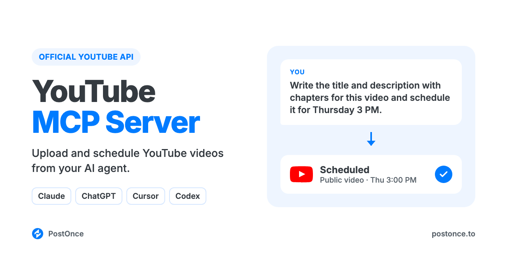

<p align="center"></p>

# YouTube MCP Server

YouTube MCP server for Claude, ChatGPT, Cursor and Codex. Your AI agent can upload, publish and schedule YouTube videos and Shorts on your channel, with the title, description, privacy and category set, through YouTube's official API. There's no scraping, no browser automation and no YouTube developer app to set up.

It runs on [PostOnce](https://postonce.to)'s hosted MCP server and comes with YouTube skills for titles, descriptions, tags, scripts, Shorts and thumbnails, so your agent knows what a good upload looks like before it publishes one.

```
You:    Here's the transcript of Thursday's video. Write the title and
        description with chapters, and schedule it for Thursday 3pm as public.
Claude: Used youtube-title-generator and youtube-description-generator.
        Title: "Repurpose One Video Into 5 Posts (Full Workflow)". The
        description opens with the keyword and has 7 chapters from 00:00.
        Scheduled on PostOnce for Thu 15:00 on "Acme Studio", privacy public.
```

Full setup guide with examples: [postonce.to/mcp/youtube](https://postonce.to/mcp/youtube)

## What you can do

| Ask your agent to | How it works |
| --- | --- |
| Upload and publish a video now | `create_upload_url`, upload, then `create_post` with the video in `media` |
| Schedule a video for later | `create_post` with `publish_at`; PostOnce uploads it at that time |
| Post a Short | Upload a vertical video (up to 3 minutes). Portrait videos are treated as Shorts; YouTube makes the final call |
| Set the title and description | `platform_options.title` (up to 100 characters; defaults to the first line of the content) and `platform_options.description` (up to 5,000 characters) |
| Upload as public, unlisted or private | `platform_options.privacy` (`public`, `unlisted` or `private`; default `public`) |
| Pick the category and disclose AI-generated content | `platform_options.categoryId` (default `22`, People & Blogs) and `platform_options.ai_generated` |
| Add tags | Put up to 8 hashtags in the description; PostOnce sends them as the video's tags |
| Save a draft to finish later | `create_draft` |
| Check whether a video went out, and get its URL | `get_post` |
| Change or cancel a scheduled video | `update_post`, `cancel_post` |
| Post the same video to YouTube and other platforms | Add more targets to `create_post` (TikTok, Instagram, Facebook, LinkedIn, X, Threads, Pinterest, Bluesky) |

Every YouTube post needs one video, up to 768 MB. Uploads through `create_upload_url` accept MP4, MOV and WebM.

Not supported: community posts, text-only or image posts, playlists, marking videos as made for kids (uploads are always marked not made for kids), setting a custom thumbnail (upload it in YouTube Studio), analytics, reading or replying to comments, and editing or deleting videos after they're published.

## Setup (about a minute)

You need a [PostOnce account](https://postonce.to) (free for 7 days, no card) with your YouTube channel connected.

**Claude (claude.ai and desktop) and ChatGPT:** add a custom connector with the URL below and sign in with PostOnce. No API key.

```
https://postonce.to/mcp
```

Step-by-step: [Claude](https://postonce.to/integrations/claude) · [ChatGPT](https://postonce.to/integrations/chatgpt)

**Claude Code, Codex and Cursor:** install the plugin. It adds the MCP connection and the skills together. Claude Code asks you to sign in to PostOnce the first time you use it (or run `/mcp` and pick postonce), so there's no key to copy. In Codex and Cursor, create an API key in [PostOnce preferences](https://postonce.to/dashboard/preferences) and give it to your client as the `POSTONCE_API_KEY` environment variable. Never paste the key into chat.

```bash
# Claude Code
claude plugin marketplace add postoncehq/plugins
claude plugin install youtube-mcp@postoncehq
```

Step-by-step: [Claude Code](https://postonce.to/integrations/claude-code) · [Codex](https://postonce.to/integrations/codex) · [Cursor](https://postonce.to/integrations/cursor)

**Any other MCP client:** point it at `https://postonce.to/mcp` (Streamable HTTP) with the header `Authorization: Bearer <your PostOnce API key>`.

## Skills included

| Skill | What it does |
| --- | --- |
| [`youtube-title-generator`](skills/youtube-title-generator/SKILL.md) | Writes 10 title options that lead with the search keyword and make the click, then sets the chosen one as the video title. |
| [`youtube-description-generator`](skills/youtube-description-generator/SKILL.md) | Writes a description with the keyword in the first two lines, chapters built from your transcript, links and hashtags, within 5,000 characters. |
| [`youtube-tag-generator`](skills/youtube-tag-generator/SKILL.md) | Builds a tag set within YouTube's 500-character budget: hashtags for the description (sent as tags) plus a full list to paste into YouTube Studio. |
| [`youtube-script-generator`](skills/youtube-script-generator/SKILL.md) | Writes long-form video scripts: a hook for the first 30 seconds, retention beats, a payoff and a call to action. |
| [`youtube-shorts-script`](skills/youtube-shorts-script/SKILL.md) | Writes vertical Shorts scripts (up to 3 minutes) with the Short's title and description. |
| [`youtube-thumbnail-maker`](skills/youtube-thumbnail-maker/SKILL.md) | Plans 1280×720 thumbnail concepts and renders one to PNG when your environment can, ready to upload in YouTube Studio. |
| [`youtube-channel-description`](skills/youtube-channel-description/SKILL.md) | Writes your channel's About text and keywords for you to paste into YouTube Studio. |
| [`youtube-content-calendar`](skills/youtube-content-calendar/SKILL.md) | Plans 1–4 weeks of videos and Shorts from your goals or a source, drafts each one, and schedules them once the videos exist. |
| [`postonce`](skills/postonce/SKILL.md) | Publishing workflow: pick the right account, upload media, schedule, and confirm the post actually went live. |

## FAQ

**Does YouTube have an official MCP server?**
This server uses YouTube's official API (the YouTube Data API) through PostOnce. It uploads videos to your channel with the title, description, privacy and category you choose.

**Can Claude upload videos to YouTube?**
Yes, once it's connected to an MCP server that can publish, like this one. Claude writes the title and description, uploads the video with `create_upload_url`, then calls `create_post`.

**Is it safe for my YouTube channel?**
Yes. Uploads go through YouTube's official API with the permissions you grant when you connect your channel. Many YouTube MCP servers on GitHub drive a logged-in browser or rely on unofficial or scraped endpoints instead, which YouTube's Terms of Service don't allow and which can get channels restricted.

**Do I need a Google Cloud project or YouTube API key?**
No. PostOnce holds the YouTube API access; you just connect your channel.

**Can it post YouTube Shorts?**
Yes. Upload a vertical video of up to 3 minutes and it's treated as a Short. YouTube decides the final format from the video itself. The `youtube-shorts-script` skill writes the script, title and description.

**Can it set a custom thumbnail?**
No. The `youtube-thumbnail-maker` skill designs and renders the image, and you upload it in YouTube Studio after the video is up.

**Is it free?**
The skills and this repo are free and MIT-licensed. Publishing runs through a PostOnce account, which you can try free for 7 days without entering a card. After that, see [pricing](https://postonce.to/pricing).

## Data and privacy

- The posts, captions and media you ask your agent to publish are sent to PostOnce and on to the platforms you choose. Nothing is published without a request from you.
- Media files you upload go straight to PostOnce's file storage through a short-lived signed upload link, then publish from there. Uploaded media is publicly reachable so the platforms can fetch it.
- PostOnce stores your posts, media and connected account names so it can schedule them and show your publishing history. You can disconnect accounts and revoke access at any time in [PostOnce preferences](https://postonce.to/dashboard/preferences).
- The skills themselves run in your agent and send nothing anywhere else.

Full details: [privacy policy](https://postonce.to/privacy-policy) · [terms](https://postonce.to/tos).

## Other platforms

The same connection posts everywhere PostOnce supports. Platform repos with their own skills:
[LinkedIn MCP](https://github.com/postoncehq/linkedin-mcp) · [Instagram MCP](https://github.com/postoncehq/instagram-mcp) · [TikTok MCP](https://github.com/postoncehq/tiktok-mcp) · [Facebook MCP](https://github.com/postoncehq/facebook-mcp) · [X (Twitter) MCP](https://github.com/postoncehq/x-mcp) · [Threads MCP](https://github.com/postoncehq/threads-mcp) · [Bluesky MCP](https://github.com/postoncehq/bluesky-mcp) · [Pinterest MCP](https://github.com/postoncehq/pinterest-mcp)

## License

MIT. See [LICENSE](LICENSE).
